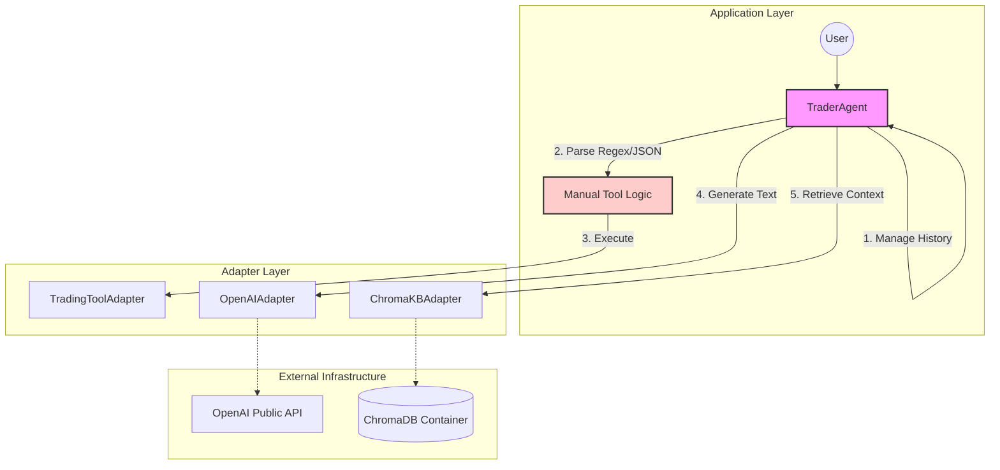

# Architecture Evolution: Local to Azure Enterprise Stack

## 1. Architecture Overview

The CryptoFlow system has evolved to support a hexagonal adapter strategy, allowing the application to switch between a **Local Stack** (ChromaDB, OpenAI public API, manual orchestration) and an **Enterprise Stack** (Azure AI Search, Azure OpenAI, Microsoft Semantic Kernel). This flexibility ensures that developers can test locally using lightweight containers while deploying to a secure, compliant, and scalable environment in production.

## 2. Component Analysis

### 2.1. The Inference Engine (LLM Provider)

The system supports two distinct implementations for the Language Model provider.

*   **Legacy (Standard OpenAI API):** Utilizes public API endpoints (`api.openai.com`). In this configuration, data traverses the public internet to general-purpose model instances shared across OpenAI's user base.
*   **Enterprise (Azure OpenAI Service):** Utilizes private, managed model instances hosted within the Azure subscription boundaries.
    *   **Key Benefits:**
        *   **Data Privacy:** Inputs and outputs are not used for model training by Microsoft or OpenAI.
        *   **Enterprise-grade SLAs:** Guaranteed uptime and reliability.
        *   **Network Security:** Support for Virtual Networks (VNETs) and Private Links.
        *   **Responsible AI:** Integrated content filtering to prevent abusive or harmful outputs.

### 2.2. The Retrieval System (Vector Store)

The retrieval mechanism has shifted from a purely dense vector approach to a more robust hybrid system.

*   **Legacy (ChromaDB):** Relies strictly on **Dense Vector Retrieval** (Cosine Similarity). It matches query embeddings to document embeddings. While efficient for semantic conceptual matching, it often struggles with exact keyword matching (e.g., specific tickers like `BTC` or IDs) if the semantic vectors are not perfectly aligned.
*   **Enterprise (Azure AI Search):** Implements **Hybrid Retrieval**.
    *   **Mechanism:** Performs Vector Search *and* Keyword Search (BM25) in parallel, combining the best of semantic understanding and exact textual matches.
    *   **Semantic Re-ranking:** A secondary deep learning model re-scores the top results from the hybrid search to maximize semantic relevance before returning them to the application. This significantly improves context quality for Retrieval-Augmented Generation (RAG) workflows.

### 2.3. The Orchestration Layer

The application logic orchestration has moved from manual plumbing to an SDK-driven approach.

*   **Legacy (Manual Implementation):** The `TraderAgent` historically handled low-level plumbing:
    *   Manual regular expression parsing to detect tool usage in the model's text output.
    *   Manual management of chat history lists and context window limits.
    *   Direct, raw API calls to provider endpoints (e.g., `requests` or basic client wrappers).
*   **Enterprise (Microsoft Semantic Kernel):** The system now utilizes the **Semantic Kernel SDK** as an abstraction layer.
    *   **Kernel:** Acts as the central orchestration unit ensuring context management, dependency injection, and connector initialization.
    *   **Plugins:** Domain tools (e.g., `execute_trade`, `get_quote`) are wrapped as native Semantic Kernel Plugins.
    *   **Auto-Function Calling:** The SDK automatically handles the definition of function schemas, the parsing of model responses, and the serialization/deserialization of tool calls between the LLM and the Python runtime.

## 3. Architectural Diagrams

### 3.1. Legacy Architecture (Manual Orchestration)


### 3.2. Enterprise Architecture (Azure Semantic Kernel)

```mermaid
--8<-- "docs/documentation/diagrams/architecture/azure_enterprise_architecture.mmd"
```
