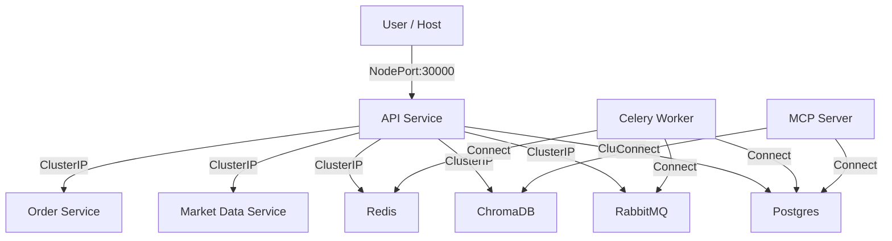

# Kubernetes Implementation Theory

This document explains the architectural decisions and theoretical concepts behind the Kubernetes implementation for CryptoFlow.

## Architecture Decisions

### 1. Deployments vs. StatefulSets for Infrastructure

**Decision**: We use `Deployment` for stateful components (Postgres, Redis, RabbitMQ) instead of `StatefulSet`.

**Reasoning**: 
- **Simplicity**: For local development (`minikube`/`kind`), managing PersistentVolumeClaims (PVCs) and StatefulSet stable identities adds unnecessary complexity.
- **Portability**: Simple Deployments are easier to tear down and recreate in a dev environment.
- **Note**: In a production environment, we would use strict `StatefulSets` or managed operators (e.g., Postgres Operator) to ensure data safety and proper replication.

### 2. Sidecar vs. Separate Deployments for gRPC

**Decision**: We split the monolithic gRPC service into `market-data` and `order-service` deployments.

**Reasoning**:
- **Scalability**: Allows independent scaling. If `market-data` ingestion is high load, we can scale it to 5 replicas while keeping `order-service` at 1.
- **Fault Isolation**: A crash in the market data service does not bring down the order processing service.
- **Service Discovery**: Each deployment gets its own ClusterIP Service, making internal discovery explicit (`market-data.default.svc.cluster.local`, `order-service.default.svc.cluster.local`).

### 3. Service Exposure Strategy

**Decision**: 
- **API**: Exposed via `NodePort`. This provides a stable port (30000) for local access from the host machine without needing an Ingress Controller setup.
- **Internal Services**: Exposed via `ClusterIP`. Databases and gRPC services are only accessed by other pods, so they do not need external IPs.

## Component Diagram

