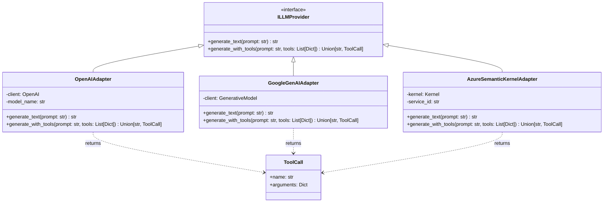
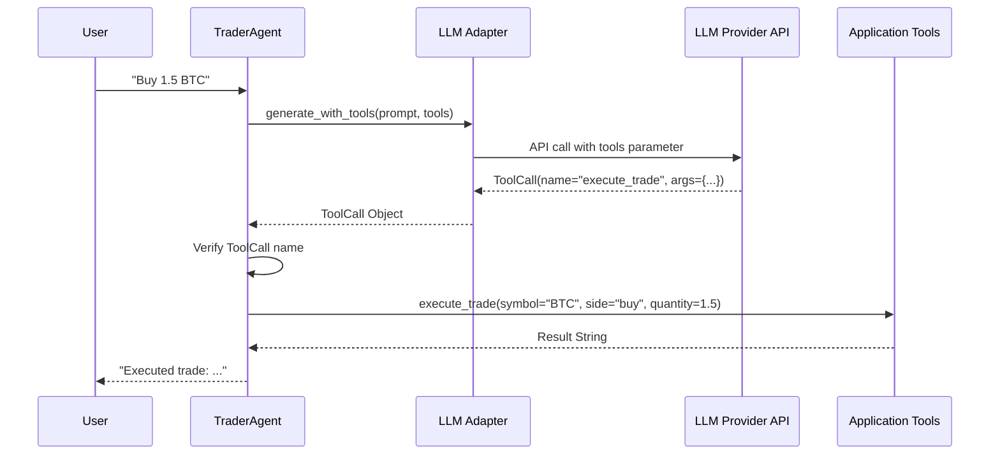

# LLM Tool Calling Implementation (Phase 3)

This document details the implementation of **LLM Tool Calling** (also known as Function Calling) within the CryptoFlow AI module. This feature enables Large Language Models to intelligently select and execute defined tools, such as trading commands, based on user input.

## Overview

The implementation provides a **provider-agnostic** abstraction for LLM tool calling through the `ILLMProvider` interface. This allows the system to work with multiple LLM providers (currently OpenAI and Google Gemini, with support for future providers) while maintaining a consistent domain model.

The core mechanism enables structured interactions where the model outputs structured data (JSON) representing a function call instead of plain text when appropriate.

## Architecture

The architecture follows the **Hexagonal Architecture** pattern:

- **Domain**: `ToolCall` and `ToolDefinition` models define the core abstraction.
- **Port**: `ILLMProvider` interface defines the `generate_with_tools` contract.
- **Adapters**: Provider-specific implementations (`OpenAIAdapter`, `GoogleGenAIAdapter`) translate domain objects to each provider's API format.
- **Application**: `TraderAgent` orchestrates the flow, remaining agnostic to the underlying provider.

### Class Diagram



## Interaction Flow

When a user sends a trading request (e.g., "Buy 1.5 BTC"), the following sequence occurs:

1.  **Agent Receives Input**: `TraderAgent` receives the prompt.
2.  **LLM Generation**: Calls the configured provider's `generate_with_tools` method.
3.  **Tool Selection**: The LLM analyzes the prompt and defined tools, deciding whether to call a tool or respond with text.
4.  **Response Parsing**: The adapter parses the provider-specific response into a `ToolCall` domain object.
5.  **Execution**: The agent executes the tool using `TradingToolAdapter`.
6.  **Feedback**: The result is returned to the user.

### Sequence Diagram



## Provider Implementations

### OpenAI Adapter

Located in [`src/ai/adapters/llm/openai.py`](file:///home/ecom/Codes/cryptoflow/src/ai/adapters/llm/openai.py), this adapter:
- **Formats Tools**: Converts tool definitions to OpenAI's `{"type": "function", "function": ...}` format.
- **API Call**: Invokes `chat.completions.create` with `tools` and `tool_choice="auto"`.
- **Parsing**: Extracts `tool_calls` from the response message and converts to `ToolCall` objects.

**Supported Models**: `gpt-4o-mini`, `gpt-3.5-turbo`, `gpt-4o`

### Google Gemini Adapter

Located in [`src/ai/adapters/llm/google.py`](file:///home/ecom/Codes/cryptoflow/src/ai/adapters/llm/google.py), this adapter:
- **Formats Tools**: Converts tool definitions to Google's function declaration format.
- **API Call**: Uses `generate_content` with function declarations.
- **Parsing**: Extracts function calls from the response and converts to `ToolCall` objects.

**Supported Models**: `gemini-2.0-flash-exp`, `gemini-1.5-pro`

### Azure Semantic Kernel Adapter

Located in [`src/ai/adapters/azure/llm_adapter.py`](file:///home/ecom/Codes/cryptoflow/src/ai/adapters/azure/llm_adapter.py), this adapter uses Microsoft's Semantic Kernel framework:

- **Kernel Initialization**: Sets up Semantic Kernel with Azure OpenAI chat completion service
- **Dynamic Plugin Registration**: Converts tool definitions to Semantic Kernel functions at runtime
- **Function Calling**: Uses SK's automatic function calling with `FunctionChoiceBehavior.Auto`
- **Response Parsing**: Extracts function call details from SK response and converts to `ToolCall` objects

**Key Features**:
- Enterprise-grade Azure OpenAI integration
- Semantic Kernel's advanced orchestration capabilities
- Support for Azure's managed identity and RBAC
- Built-in retry logic and error handling

**Supported Models**: Any Azure OpenAI deployment (e.g., `gpt-4o`, `gpt-35-turbo`)

**Configuration**:
```bash
AZURE_OPENAI_ENDPOINT=https://<resource>.openai.azure.com/
AZURE_OPENAI_API_KEY=<key>
AZURE_OPENAI_DEPLOYMENT_NAME=gpt-4o
```


### Adding New Providers

To add a new LLM provider:

1. Create a new adapter class in `src/ai/adapters/llm/` that implements `ILLMProvider`.
2. Implement `generate_with_tools` to:
   - Convert tool definitions to the provider's format
   - Make the API call
   - Parse the response into `ToolCall` or `str`
3. Update `LLMFactory` to instantiate your adapter based on environment configuration.

## Key Components

### TraderAgent

The `TraderAgent` (in [`src/ai/application/agent_service.py`](file:///home/ecom/Codes/cryptoflow/src/ai/application/agent_service.py)) acts as the orchestration layer. It:
- Receives user input
- Calls the LLM provider (via dependency injection)
- Interprets the response (tool call vs. text)
- Executes tools when requested
- Returns formatted results

This design allows seamless switching between LLM providers without changing application logic.

### Tool Definitions

Tools are defined in [`src/ai/application/tools/definitions.py`](file:///home/ecom/Codes/cryptoflow/src/ai/application/tools/definitions.py) using a provider-agnostic schema format:

```python
execute_trade_def = {
    "name": "execute_trade",
    "description": "Execute a cryptocurrency trade",
    "parameters": {
        "type": "object",
        "properties": {
            "symbol": {"type": "string", "description": "Trading symbol (e.g., BTC)"},
            "side": {"type": "string", "enum": ["buy", "sell"]},
            "quantity": {"type": "number", "description": "Amount to trade"}
        },
        "required": ["symbol", "side", "quantity"]
    }
}
```

## Configuration

### Provider Selection

The system uses `LLMFactory` to automatically select a provider based on available API keys:

1. **Azure OpenAI**: If `AZURE_OPENAI_ENDPOINT` and `AZURE_OPENAI_API_KEY` are set (checked first)
2. **Google Gemini**: If `GOOGLE_API_KEY` is set (checked second)
3. **OpenAI**: If `OPENAI_API_KEY` is set (checked third)

To force a specific provider, ensure only that provider's API key is set in your `.env` file.

### Environment Variables

```bash
# For Azure OpenAI (Semantic Kernel)
AZURE_OPENAI_ENDPOINT=https://<resource>.openai.azure.com/
AZURE_OPENAI_API_KEY=<key>
AZURE_OPENAI_DEPLOYMENT_NAME=gpt-4o

# For OpenAI
OPENAI_API_KEY=sk-...

# For Google Gemini
GOOGLE_API_KEY=...
```

### Vector Store Configuration

The system also supports multiple vector store backends:

1. **Azure AI Search**: If `AZURE_SEARCH_ENDPOINT` and `AZURE_SEARCH_API_KEY` are set
2. **ChromaDB**: Fallback if Azure is not configured

```bash
# For Azure AI Search
AZURE_SEARCH_ENDPOINT=https://<resource>.search.windows.net
AZURE_SEARCH_API_KEY=<key>
AZURE_SEARCH_INDEX_NAME=cryptoflow-docs  # optional, defaults to cryptoflow-docs
```

## Testing

### Unit Tests

Provider-specific unit tests with mocked API calls:
- [`tests/unit_tests/test_openai_mock.py`](file:///home/ecom/Codes/cryptoflow/tests/unit_tests/test_openai_mock.py)
- [`tests/unit_tests/test_azure_adapters.py`](file:///home/ecom/Codes/cryptoflow/tests/unit_tests/test_azure_adapters.py)

### Integration Tests

End-to-end tests with real API calls:
- [`tests/integration_tests/test_tool_calling.py`](file:///home/ecom/Codes/cryptoflow/tests/integration_tests/test_tool_calling.py)
- [`tests/integration_tests/test_azure_integration.py`](file:///home/ecom/Codes/cryptoflow/tests/integration_tests/test_azure_integration.py)

Run integration tests:
```bash
# General tool calling test
python3 tests/integration_tests/test_tool_calling.py

# Azure-specific integration test
python3 tests/integration_tests/test_azure_integration.py
```

## Future Enhancements

- **Multi-tool Support**: Handle multiple tool calls in a single response
- **Tool Chaining**: Allow tools to call other tools
- **Streaming Responses**: Support streaming for long-running tool executions
- **Additional Providers**: Anthropic Claude, Cohere, local models via Ollama
- **Azure Managed Identity**: Support for passwordless authentication
